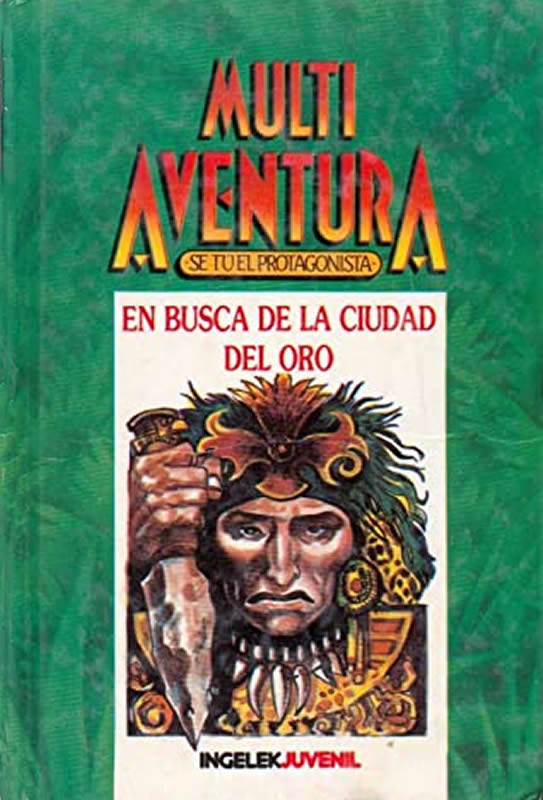

# MULTIAVENTURA
MultiAventura fue una colección de [librojuegos](#librojuego) que se vendió en quioscos en el año 1986 en España por el sello Ingelek Juvenil.  

Este repositorio es una colección de información disponible sobre el tema, con enlaces a material complementario sobre la editorial, los autores, etc. También quiere, con el tiempo *y si se consiguen las autorizaciones necesarias*, convertirse en un repositorio de los libros en sí, modificaciones y correcciones, e incluso, conversiones a otros sistemas de ficción interactiva.

## Perspectiva histórica

### Relevancia
Para muchos de nosotros, jóvenes de las décadas de los 70~80, fue la primera toma de contacto con dicho tipo de libros, y un precursor (individual) de nuestra afición a los [juegos de rol](#defrpg), [ficción interactiva](#defif), [aventuras conversacionales](#defadconv) y [videoaventuras](#defvad), hasta terminar en las últimas en llegar a occidente, las [novelas visuales](#defvisnov). Todas estas parten de orígenes comunes y han llegado a formar una pequeña serie de subculturas-nicho en distintas épocas y lugares.

Detalle notable sobre MultiAventura es que fue editado por la editorial [Ingelek S.A.](#aboutingelek), que durante la década de los 80 (y principio de los 90) se dedicó a crear fascículos coleccionables de gran calidad, muchos de ellos en formato libro, a un precio razonable y sobre temas técnicos y de actualidad. Eso causó que esta colección de libros fuese muy superior a otras similares en **calidad**, **precio** y **accesibilidad al gran público**.

### Diferencias
A diferencia de otras colecciones, que eran editadas a un ritmo irregular en librerías convencionales, traducciones de obras extranjeras (aunque casi todas de obras reconocidas), en formato bolsillo reducido y tapa blanda, y con unas pocas ilustraciones a tinta de pequeño tamaño, como por ejemplo, la de **Elige tu propia aventura** de la editorial *Timun Mas*, esta fue una colección originalmente semanal, fácilmente accesible en quioscos de toda la nación, escrita por una selección de autores de literatura juvenil españoles, editadas en formato (casi) cuartilla y con tapa dura, e ilustraciones grandes y a todo color por ilustradores reconocidos en el mundo del comic, ilustración de literatura juvenil y videojuegos de la misma época.

|               | MultiAventura   Ingelek | Otras colecciones   Timun Mas |
|---------------|----------------------|----------------------|
| Publicación   | Semanal / quincenal  | Irregular            |
| Distribución  | Quioscos             | Librerias            |
| Textos        | Original y Nacional  | Traducciones         |
| Arte          | Alta calidad   a todo color | Baja calidad   blanco y negro |
| Edición       | Bolsillo Completo ó Cuartilla   13x23 cm | Bolsillo Reducido   10x18cm |
| Tapa          | Dura, color          | Blanda, color        |

## Sobre Ingelek
TO DO:
En esta sección se incorporará una pequeña introducción a la trayectoria profesional de la editorial Ingelek, fundación, principios, listado de productos y personajes notables dentro de la compañia hasta su cierre.
Aquí también pondremos una pequeña biografía sobre Antonio M. Ferrér Abelló, editor, supervisor y productor, e incluso a veces, redactor, de las distintas colecciones y libros editados por Ingelek. Ciertamente era raro no verle en los créditos de los fascículos que editaba, no solo como director de la colección, sino a veces como colaborador, especialmente en fascículos de temas técnicos y económicos.
https://amstrad.es/doku.php?id=companias:ingelek
https://www.einforma.com/servlet/app/prod/ETIQUETA_EMPRESA/nif/OlwKQy3DsxK7RVfC6dNBKg
https://www.boe.es/boe/dias/2022/07/25/pdfs/BOE-A-2022-12337.pdf
https://www.boe.es/diario_boe/txt.php?id=BOE-A-2022-12337

https://www.axesor.es/Informes-Empresas/108700/INGELEK_SA.html
https://www.infoempresas.pro/empresa/ingelek-s-a/

Nombre         : INGELEK S.A.
Objeto Social  : ?
Forma jurídica :	SOCIEDAD ANONIMA
Direcc. Fiscal : PLAZA REPUBLICA DEL ECUADOR, 2, CP: 28016, Madrid, Madrid, España
Telefono       : 914579424, 914579513

NIF            : A28608388						(Número de Identificación Fiscal)
CNAE           : 5814 Edición de revistas		(Clasificación Nacional de Actividad Económica) 
				 5811 Edición de libros
SIC            : 2721 Edición de revistas		(Clasificación Industrial Estándar (Standard Industrial Clasification, SIC))
Reg. mercantil : R.M. de la Comunidad de Madrid
Fecha          : 02 de Marzo   de 1984 (Constitución)
				 25 de Octubre de 1990 {Revocación
		         18 de Mayo    de 2022 (Revocación NIF)
				 25 de julio   de 2022 (Revocación NIF / Publicación en el BOE)

https://www.cnae.com.es/lista-actividades.php 
https://ine.es/dyngs/INEbase/es/operacion.htm?c=Estadistica_C&cid=1254736177032&menu=ultiDatos&idp=1254735976614
https://kryptonsolid.com/clasificacion-industrial-estandar-codigo-sic-definicion/#:~:text=Recomendaciones%20clave%201%20Los%20c%C3%B3digos%20de%20Clasificaci%C3%B3n%20Industrial,del%20Norte%20%28NAICS%29%20de%20seis%20d%C3%ADgitos.%20M%C3%A1s%20elementos

Editorial española, ya desaparecida, que editó varias revistas y libros españoles sobre la gama Amstrad. Ésta revocó el 25 de octubre de 1990, con el número de anuncio 142730 en el registro mercantil de Madrid. Tenía un capital social de 7.512,65 € y un número de 9 empleados. Llegó a desarrollar y publicar algún que otro juego.

## Sobre la colección
La colección Multiaventura era una colección de librojuegos del género "elige tu propia aventura" (Choose Your Own Adventure, CYOA), usualmente bastante estandar y simplista, aunque algunos tenian mecánicas de juego mas complejas, como recursos u objetos llave, haciendoles ideales para ser portados a cualquier tipo de ficción interactiva digital.  

Los libros eran una mezcla de historias originales, la mayoria inconexas, aunque algunas tenían protagonistas recurrentes que las dotaban de una cierta continuidad, con otras historias basadas en clásicos de la literatura y del cine de aventuras, terror y/o ciencia-ficción.  

### Créditos y licencias
Los créditos generales de cada volumen de la colección aparecen en la segunda página de cada tomo:

> Director de la colección: *Antonio M. Ferrer Abelló*
> Director de producción: *Vicente Robles*
> Textos: *Autor(es) de los textos correspondientes a dicho tomo*
> Ilustraciones: *Autor(es) de las ilustraciones correspondientes a dicho tomo*
> Diseño: *Bravo/Lofish*
> Maquetación: *Carlos González Amezúa*
> &copy; Antonio M. Ferrer Abelló
> &copy; Ediciones Ingelek S. A. 
>
>	Todos los derechos reservados. Este libro no puede ser, en parte o totalmente, reproducido, memorizado en sistemas de archivo, o transmitido en cualquier forma o medio, electrónico, mecánico, fotocopia o cualquier otro sin la previa autorización del editor.
>
>	ISBN del tomo: 84-85831-XX-X
>	ISBN de la obra: 84-85831-70-5
>	Fotocomposición: Vierna, S. A.
>	Fotomecánica: Ochoa
>	lmprime: Gráficas Reunidas, S. A.
>	Depósito Legal: M. 16.XXX-1986
	
### Autores
| Nº | Título                                          | Textos                                                       | Ilustraciones                                            |
| -- | ----------------------------------------------- | ------------------------------------------------------------ | -------------------------------------------------------- |
| 01 | **Nuevo viaje al centro de la Tierra.**         | [Pedro Montero](biografias/pedro-montero.md)                 | [Alfonso Azpiri Mejía](biografias/azpiri.md)             |
| 02 | **Los caballeros de la galaxia.**               | [Carlos Saiz Cidoncha](biografias/carlos-saiz-cidoncha.md)   | [Alfonso Azpiri Mejía](biografias/azpiri.md)             |
| 03 | **El caso Brackenstall.**                       | [Pablo Barrena](biografias/pablo-barrena.md)                 | [Justo Jimeno Bazaga](biografias/justo-jimeno.md)        |
| 04 | **Los viajeros del tiempo.**                    | [Pedro Montero](biografias/pedro-montero.md)                 | [Antonio Perera Sarmiento](biografias/perera.md)         |
| 05 | **Tu nombre es Robinson.**                      | [Miguel Gonzales Casquell](biografias/miguel-gonzales-casquell.md)  | [Antonio Perera Sarmiento](biografias/perera.md)  |
| 06 | **Aventuras en el Mississippi.**                | [José Ramon Azpiri](biografias/jose-ramon-azpiri.md)   [José María Méndez](biografias/jose-maria-mendez.md) | [Alfonso Azpiri Mejía](biografias/azpiri.md) |
| 07 | **El mundo perdido del profesor Challenger.**   | [José Ramon Azpiri](biografias/jose-ramon-azpiri.md)   [José María Méndez](biografias/jose-maria-mendez.md) | [Antonio Perera](biografias/perera.md)    |
| 08 | **El secreto de la isla misteriosa.**           | [Pablo Barrena](biografias/pablo-barrena.md)                 | [Justo Jimeno Bazaga](biografias/justo-jimeno.md)        |
| 09 | **El sabueso del infierno.**                    | [Pedro Montero](biografias/pedro-montero.md)				  | [Justo Jimeno Bazaga](biografias/justo-jimeno.md)        |
| 10 | **Soy invisible.**                              | [Pedro Montero](biografias/pedro-montero.md)				  | [Antonio Perera Sarmiento](biografias/perera.md)         |
| 11 | **El invitado de Dracula.**                     | [José Ramon Azpiri](biografias/jose-ramon-azpiri.md)         | [Alfonso Azpiri Mejía](biografias/azpiri.md)             |
| 12 | **En la corte del Rey Arturo.**                 | [José Antonio Azcano](biografias/jose-antonio-azcano.md)     | [Justo Jimeno Bazaga](biografias/justo-jimeno.md)        |
| 13 | **Capitán de nave estelar.**                    | [Carlos Saiz Cidoncha](biografias/carlos-saiz-cidoncha.md)   [Antonio Ferrer](biografias/antonio-ferrer.md) | [Alfonso Azpiri Mejía](biografias/azpiri.md) |
| 14 | **Los piratas de Malasia.**                     | [Miguel Gonzales Casquell](biografias/miguel-gonzales-casquell.md) | [Rodrigo Hernández Cabos](biografias/rodri.md)     |
| 15 | **El castillo de Hangyord.**                    | [Carlos Saiz Cidoncha](biografias/carlos-saiz-cidoncha.md)   | [Alfonso Azpiri Mejía](biografias/azpiri.md)             |
| 16 | **Viaje a otras dimensiones.**                  | [Pedro Montero](biografias/pedro-montero.md)                 | [Antonio Perera Sarmiento](biografias/perera.md)        |
| 17 | **Fantasmas S.A.**                              | [José Ramon Azpiri](biografias/jose-ramon-azpiri.md)   [José María Méndez](biografias/jose-maria-mendez.md) | [Rodrigo Hernández Cabos](biografias/rodri.md) |
| 18 | **En busca de la ciudad de oro.**               | [Miguel Gonzales Casquell](biografias/miguel-gonzales-casquell.md) | [Justo Jimeno Bazaga](biografias/justo-jimeno.md)  |
| 19 | **Viajes en un OVNI.**                          | [Pedro Montero](biografias/pedro-montero.md)                 | [Antonio Perera Sarmiento](biografias/perera.md)         |
| 20 | **El ojo de K'horiandr.**                       | [José Ramon Azpiri](biografias/jose-ramon-azpiri.md)   [José María Méndez](biografias/jose-maria-mendez.md) | [Alfonso Azpiri Mejía](biografias/azpiri.md) |
    
### Publicación
ISBN de la obra en su conjunto es 84-85831-70-5. La colección se publicó hasta el tomo 20, pero se considera incompleta, dado que hay declaraciones de algunos de los autores sobre más libros proyectados que nunca fueron publicados [buscar referencia]. Es más que probable que dado el tipo de productos que generaba la editorial, la colección final estuviese planeada para ser publicada durante todo un año, lo que daría un hipotético número de libros de entre 24 (meses, 2 años), 26 (quincenas, 1 año) o 52 (semanas, 1 año), pero se acortara debido a altos costes de producción o ventas insuficientes.

Originalmente se lanzó de forma semanal, pero al poco tiempo se pasó a una periodicidad quincenal, más acorde a su precio y al poder adquisitivo del público objetivo.

| Nº | Título                                      | ISBN          | Depósito legal   | Fecha publicación | Periodicidad | Precio   |
| -- | ------------------------------------------- | ------------- | -----------------| ----------------- | ------------ | -------- |
| 01 | Nuevo viaje al centro de la Tierra.         | 84-85831-69-1 | M. 16.045—1986   | Martes XX-XX-1986 | Semanal      |          |
| 02 | Los caballeros de la galaxia.               | 84-85831-68-3 | M. 16.045—1986   | Martes XX-XX-1986 | Semanal      |          |
| 03 | El caso Brackenstall.                       |               |                  | Martes XX-XX-1986 | Semanal      |          |
| 04 | Los viajeros del tiempo.                    |               |                  | Martes XX-XX-1986 | Semanal      |          |
| 05 | Tu nombre es Robinson.                      |               |                  | Martes XX-XX-1986 | Semanal      |          |
| 06 | Aventuras en el Mississippi.                |               |                  | Martes XX-XX-1986 | Semanal      |          |
| 07 | El mundo perdido del profesor Challenger.   |               |                  | Martes XX-XX-1986 | Semanal      |          |
| 08 | El secreto de la isla misteriosa.           |               |                  | Martes XX-XX-1986 | Semanal      |          |
| 09 | El sabueso del infierno.                    |               |                  | Martes XX-XX-1986 | Semanal      |          |
| 10 | Soy invisible.                              |               |                  | Martes XX-XX-1986 | Semanal      |          |
| 11 | El invitado de Dracula.                     |               |                  | Martes XX-XX-1986 | Semanal      |          |
| 12 | En la corte del Rey Arturo.                 |               |                  | Martes XX-XX-1986 | Semanal      |          |
| 13 | Capitán de nave estelar.                    | 84-85831-91-8 | M. 23.154—1986   | Martes XX-XX-1986 | Quincenal    |          |
| 14 | Los piratas de Malasia.                     |               |                  | Martes XX-XX-1986 | Quincenal    |          |
| 15 | El castillo de Hangyord.                    |               |                  | Martes XX-XX-1986 | Quincenal    |          |
| 16 | Viaje a otras dimensiones.                  |               |                  | Martes XX-XX-1986 | Quincenal    |          |
| 17 | Fantasmas S.A.                              |               |                  | Martes XX-XX-1986 | Quincenal    |          |
| 18 | En busca de la ciudad de oro.               |               |                  | Martes XX-XX-1986 | Quincenal    |          |
| 19 | Viajes en un OVNI.                          |               |                  | Martes XX-XX-1986 | Quincenal    |          |
| 20 | El ojo de K'horiandr.                       |               |                  | Martes XX-XX-1986 | Quincenal    |          |

https://librojuegos.org/2014/02/los-caballeros-de-la-galaxia-multiaventura/
https://rol-peru.com/tienda/literatura-rolera/multiaventuras-ingelek-juvenil-coleccion-completa-de-20-novelas/
https://pequitoelaventurero.blogspot.com/2008/10/multiaventura-se-tu-el-protagonista.html?m=1
https://www.commodorespain.es/video-basic-preservanda-la-coleccion-de-commodore-64/
http://librojuego.blogspot.com/2013/11/?m=0
https://es.wikipedia.org/wiki/Multiaventura
https://www.elotrolado.net/hilo_a-los-37-y-volviendo-de-nuevo-a-una-aficion-los-libro-juegos_2014986
https://programbytes48k.wordpress.com/category/libros-2/page/2/
https://programbytes48k.wordpress.com/2018/07/04/la-enciclopedia-practica-de-la-informatica-de-nueva-lente-ingelek-1983/

### Temática
La colección tenia un amplio espectro de referencias a géneros literarios, aunque se agrupaban en principalmente 3 grandes grupos, que se distinguian por la maquetación de las propias tapas, en el color e ilustraciones de la portada y contraportada. Estas podian ser:

1.  Para el género de *aventuras*, *exploración*, o *piratería*, una trama de "jungla de hojas verdes", con una palmera y una serpiente en la contraportada.
2.  Para el género *espacial*, *misterio* o la *ciencia ficción*, un "cielo azul estrellado", con la silueta roja de una nave espacial surcando el espacio orbitando a una estrella eclipsada en la contraportada.
3.  Para el género de *horror*, *sobrenatural* o *fantasía*, una "noche negra cerrada" en la que se distinguen la silueta de un bósque de coníferas, y la de una mansión victoriana completamente oscurecida excepto por una única ventana iluminada en la portada.
4.  Se ha comentado la posible existencia de un cuarto tipo para posibles obras policiacas o de misterio que no llegó a usarse.

| Portada                            | Nº   Título                                   | Temática   Referencia   Ambientación   | Reseña                             |
| ---------------------------------- | ------------------------------------------------ | -------------------------------------------- | ---------------------------------- |
|  | 01   **Nuevo viaje al centro de la Tierra.**  | Exploración   Clásicos literatura   **Viaje al centro de la tierra**   (*Jules Verne*) | *** |
|  | 02   **Los caballeros de la galaxia.**        | Espacial      --                    --    | Eres un Caballero de la Galaxia y te enorgulleces de ello.  Marchas ahora por los pasillos del castillo milenario de Thanaberán. El Gran Maestre te ha llamado para tu primera misión.  Cuando te enteras de qué se trata, sientes como si un trozo de hielo se deslizase a lo largo de tu espina dorsal: todo el Universo se halla en peligro y se espera que tú lo salves.  ¿Podrás aceptar tal responsabilidad? ¿Sabrás hacer frente a los enormes peligros que te acechan a partir de este momento? |
|  | 03   **El caso Brackenstall.**                | Horror        --                    --    | *** |    
|  | 04   **Los viajeros del tiempo.**             | Sci-Fi.       Original              Continuidad de PP y Clara   | *** |
|  | 05   **Tu nombre es Robinson.**               | Exploracion   Clásicos literatura   Robinson Crusoe (Daniel Defoe)      | *** |
|  | 06   **Aventuras en el Mississippi.**         | Fantasia?     Clásicos literatura   Cabaña de Tio Tom / Tom Sawyer (Mark Twain) | *** |
|  | 07   **El mundo perdido del profesor Challenger.**  | Exploración   ?               --    | *** |
|  | 08   **El secreto de la isla misteriosa.**    | Sci-Fi.       Clásicos literatura     La isla misteriosa (Jules Verne)                | |
|  | 09   **El sabueso del infierno.**             | Horror        --                                                                      | |
|  | 10   **Soy invisible.**                       | Sci-Fi.       Original                Continuidad de PP y Clara                       | |
|  | 11   **El invitado de Dracula.**              | Horror        Clásicos literatura     Drácula (Bram Stoker)                           | |
|  | 12   **En la corte del Rey Arturo.**          | Aventuras     Clásicos literatura     Un yanqui en la corte del rey Arturo (Mark Twain) | |
|  | 13   **Capitán de nave estelar.**             | Espacial      --                                                                      | |
|  | 14   **Los piratas de Malasia.**              | Pirateria     Clásicos literatura     Sandokán (Emilio Salgari)                       | |
|  | 15   **El castillo de Hangyord.**             | Fantasía      --                                                                      | |
|  | 16   **Viaje a otras dimensiones.**           | Sci-Fi        Original                Continuidad de PP y Clara                       | |
|  | 17   **Fantasmas S.A.**                       | Horror        --                                                                      | |
|  | 18   **En busca de la ciudad de oro.**        | Exploración   --                                                                      | |
|  | 19   **Viajes en un OVNI.**                   | Sci-Fi        Original                Continuidad de PP y Clara                       | |
|  | 20   **El ojo de K'horiandr.**                | Fantasia      Original                                                                | |
														

## Definiciones

### librojuego:
Un *librojuego* es una obra literaria escrita de forma que el lector/jugador se involucre en el desarrollo de la misma, pudiendo decidir sobre el curso de esta.

Para ello, se pone al lector en el papel del protagonista, escribiendo la historia en *segunda persona*, y pidiendo al lector en momentos cruciales que tome una *decisión que altere el curso de la historia*. Existen algunos con reglas de juego más complejas: con contadores, inventarios, hojas de personajes con características y habilidades, etc., más cercanos a un juego de rol o a la ficción interactiva.

La manera más simple de lograrlo es dividir la historia en secciones, a veces de una o dos páginas como máximo, a veces más pequeñas como uno o dos parrafos, y hacer al lector saltar entre ellas según la decisión tomada, estando estas secciones ordenadas de manera aleatoria para que le cueste más al lector hacer trampa y saltarse parte de la historia sin seguir un orden.

| Ejemplo de *libro tradicional*               | Ejemplo de *librojuego*                                  |
| -------------------------------------------- | -------------------------------------------------------- |
| **Microrelato** por _Augusto Monterroso_     | **Microaventura** por _Rubén Martínez Cabello_           |
| Y cuando despertó el dinosaurio seguía ahí.  | Pulse [aquí](ejemplos/example-gamebook.html) para jugar. |

